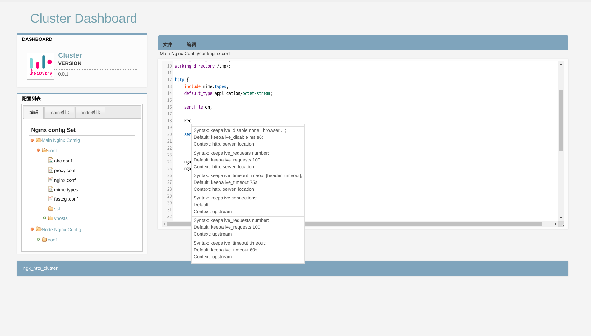

<!-- PROJECT SHIELDS -->
<!--
*** I'm using markdown "reference style" links for readability.
*** Reference links are enclosed in brackets [ ] instead of parentheses ( ).
*** See the bottom of this document for the declaration of the reference variables
*** for contributors-url, forks-url, etc. This is an optional, concise syntax you may use.
*** https://www.markdownguide.org/basic-syntax/#reference-style-links
-->
[![Contributors][contributors-shield]][contributors-url]
[![Forks][forks-shield]][forks-url]
[![Stargazers][stars-shield]][stars-url]
[![Issues][issues-shield]][issues-url]
[![MIT License][license-shield]][license-url]

<!-- PROJECT LOGO -->
<br />
<p align="center">
  <a href="https://github.com/vyouzhi">
    
  </a>

  <h3 align="center">ngx_http_cluster</h3>

  <p align="center">
    ngx_http_cluster is nginx module cluster main Control any nodes!
    <br />
    ngx_http_cluster 是 nginx 集群管理配置的模块插件
    <br />
    <a href="https://github.com/vyouzhis/ngx_http_cluster"><strong>Explore the docs »</strong></a>
    <br />
    <br />
    <a href="https://github.com/vyouzhis/ngx_http_cluster">View Demo</a>
    ·
    <a href="https://github.com/vyouzhis/ngx_http_cluster/issues">Report Bug</a>
    ·
    <a href="https://github.com/vyouzhis/ngx_http_cluster/issues">Request Feature</a>
  </p>
</p>

<!-- TABLE OF CONTENTS -->
## 栏目(Table of Contents)

- [栏目(Table of Contents)](#栏目table-of-contents)
- [关于该项目(About the Project)](#关于该项目about-the-project)
  - [依赖关系(Built With)](#依赖关系built-with)
- [起始(Getting Started)](#起始getting-started)
  - [编译安装(Installation)](#编译安装installation)
- [配置(Usage)](#配置usage)
- [集群(Cluster)](#集群cluster)
- [|ngx_cluster_node | location | node 节点的指令  |](#ngx_cluster_node--location--node-节点的指令--)
- [WebAPI](#webapi)
- [License](#license)
- [Contact](#contact)

<!-- ABOUT THE PROJECT -->
## 关于该项目(About the Project)

采用 ngx_http_subrequest API 方式来管理不同节点的配置文件：

**拥有热更新参数(Runtime Configuration)**

### 依赖关系(Built With)

需要用到的软件版本.

1. [nginx](http://nginx.org/en/download.html)
2. [ngx_http_cluster](https://github.com/vyouzhis/ngx_http_cluster)

<!-- GETTING STARTED -->
## 起始(Getting Started)



需要下载以下的文件.

### 编译安装(Installation)

1. 在这儿选择 nginx 的版本 [http://nginx.org/download/nginx-1.18.0.tar.gz](http://nginx.org/en/download.html)
2. 下载nginx

```sh
wget http://nginx.org/download/nginx-1.18.0.tar.gz
```

1. 解压

```sh
tar -zxvf nginx-1.18.0.tar.gz
```

1. git clone ngx_http_cluster

```JS
git clone https://github.com/vyouzhis/ngx_http_cluster.git
```

1. 编译安装

```sh
./configure --add-module=../ngx_http_cluster --with-http_ssl_module
gmake
gmake install
```

<!-- USAGE EXAMPLES -->
## 配置(Usage)

> cluster action

| 指令        | 区域           | 说明  |
| ------------- |:-------------:| -----:|
| ngx_cluster_filter      | server | 配置文件的读取，默认是读取 .conf .upstream .location |

## 集群(Cluster)

>main cluster

| 指令        | 区域           | 说明  |
| ------------- |:-------------:| -----:|
|ngx_cluster_main | location | 主节点的指令  |
|ngx_cluster_sync | location | 同步指令  |
|ngx_cluster_branch | location | 同步到 node 节点指令  |

> node cluster

| 指令        | 区域           | 说明  |
| ------------- |:-------------:| -----:|
|ngx_cluster_node | location | node 节点的指令  |
---
>cluster 工作的思维图

```text
                        user web api Control nodes

                       +-------------------------+
        restful api--->|    main nginx server    |
                       +------------+------------+
                                    |
                +-------------------+-----------------+
                |                   |                 |
                |                   |                 |
   +------------+-----+   +---------+---------+    +--+---------------+
   |node1 nginx server|   | node2 nginx server|    |node3 nginx server|
   +------------------+   +-------------------+    +------------------+
```

>配置文件会保存在 conf/.config 目录下面

```text
[root@x1carbon conf]# ls -l .config/conf/
abc.conf      fastcgi.conf  mime.types    nginx.conf    proxy.conf    ssl/          vhosts/  
```

> 参考配置 [nginx example conf](https://github.com/vyouzhis/ngx_http_cluster/tree/master/doc/main_nginx.conf)

## WebAPI
> restful api

|     restful api   | mothen           | 说明  |
| ------------- |:-------------:| -----:|
| /get/list | POST      |   获取配置列表   |

>/get/list

```text
// 获取主节点的配置列表
POST http://localhost:1234/main/get/list HTTP/1.1

//获取 node 节点配置列表
POST http://localhost:1234/node/get/list HTTP/1.1

```

|     restful api   | mothen           | 说明  |
| ------------- |:-------------:| -----:|
| /get/config | POST      |   获取某个配置内容   |

>/get/config

```text
// 获取主节点的配置内容
POST http://localhost:1234/main/get/config HTTP/1.1
Content-Type: "application/x-www-form-urlencoded"

path=nginx.conf

###

//获取 node 节点配置内容
POST http://localhost:1234/node/get/config HTTP/1.1
Content-Type: "application/x-www-form-urlencoded"

path=nginx.conf
```

|     restful api   | mothen           | 说明  |
| ------------- |:-------------:| -----:|
| /new/server | POST      |   添加一个新的server   |

>/new/server

```text
//main  添加一个新的server
POST http://localhost:1234/main/new/server HTTP/1.1
Content-Type: "application/x-www-form-urlencoded"

domain=www.abc.com

###

//node 添加一个新的server
POST http://localhost:1234/node/new/server HTTP/1.1
Content-Type: "application/x-www-form-urlencoded"

domain=www.abc.com
```

|     restful api   | mothen           | 说明  |
| ------------- |:-------------:| -----:|
| /delete/server | POST      |  删除一个server   |

>/delete/server

```text
//main  删除一个server
POST http://localhost:1234/main/delete/server HTTP/1.1
Content-Type: "application/x-www-form-urlencoded"

domain=www.abc.com

###

//node 删除一个server
POST http://localhost:1234/node/delete/server HTTP/1.1
Content-Type: "application/x-www-form-urlencoded"

domain=www.abc.com
```

|     restful api   | mothen           | 说明  |
| ------------- |:-------------:| -----:|
| /update/config | POST      |  更新一个配置   |

>/update/config

```text
//main  更新一个配置

POST http://localhost:1234/main/update/config HTTP/1.1
Content-Type: "application/x-www-form-urlencoded"

base64=base64_data&path=nginx.conf

###

//node 更新一个配置

POST http://localhost:1234/node/update/config HTTP/1.1
Content-Type: "application/x-www-form-urlencoded"

base64=base64_data&path=nginx.conf
```

|     restful api   | mothen           | 说明  |
| ------------- |:-------------:| -----:|
| /commit/config | POST      |  commit一个配置   |

>/commit/config

```text
//main  commit 配置


POST http://localhost:1234/main/commit/config HTTP/1.1
Content-Type: "application/x-www-form-urlencoded"

###

//node commit 配置

POST http://localhost:1234/node/commit/config HTTP/1.1
Content-Type: "application/x-www-form-urlencoded"
```

<!-- LICENSE -->
## License

Distributed under the MIT License. See `LICENSE` for more information.

<!-- CONTACT -->
## Contact

vyouzhi - [@github](https://github.com/vyouzhis/ngx_http_cluster) - vouzhi@gmail.com

<!-- MARKDOWN LINKS & IMAGES -->
<!-- https://www.markdownguide.org/basic-syntax/#reference-style-links -->
[contributors-shield]: https://img.shields.io/github/contributors/vyouzhis/ngx_http_cluster.svg?style=flat-square
[contributors-url]: https://github.com/vyouzhis/ngx_http_cluster/graphs/contributors
[forks-shield]: https://img.shields.io/github/forks/vyouzhis/ngx_http_cluster.svg?style=flat-square
[forks-url]: https://github.com/vyouzhis/ngx_http_cluster/network/members
[stars-shield]: https://img.shields.io/github/stars/vyouzhis/ngx_http_cluster.svg?style=flat-square
[stars-url]: https://github.com/vyouzhis/ngx_http_cluster/stargazers
[issues-shield]: https://img.shields.io/github/issues/vyouzhis/ngx_http_cluster.svg?style=flat-square
[issues-url]: https://github.com/vyouzhis/ngx_http_cluster/issues
[license-shield]: https://img.shields.io/github/license/vyouzhis/ngx_http_cluster.svg?style=flat-square
[license-url]: https://github.com/vyouzhis/ngx_http_cluster/blob/master/LICENSE.txt
[linkedin-shield]: https://img.shields.io/badge/-LinkedIn-black.svg?style=flat-square&logo=linkedin&colorB=555
[product-screenshot]: images/screenshot.png
